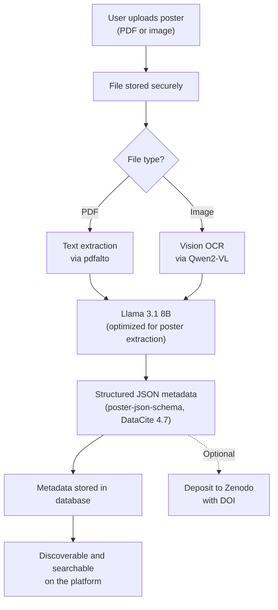

<div align="center">


<br />

<h1>Posters.science</h1>

<p>
A free, open-source platform for sharing, discovering, and citing scientific posters.
</p>

<br />

<p>
  <a href="https://github.com/fairdataihub/posters-science/graphs/contributors">
    
  </a>
  <a href="https://github.com/fairdataihub/posters-science/stargazers">
    
  </a>
  <a href="https://github.com/fairdataihub/posters-science/issues/">
    
  </a>
  <a href="https://github.com/fairdataihub/posters-science/blob/main/LICENSE">
    
  </a>
</p>

<h4>
    <a href="https://posters.science">Website</a>
  <span> · </span>
    <a href="https://dev.posters.science">Developer Docs</a>
  <span> · </span>
    <a href="https://github.com/fairdataihub/posters-science/issues/">Report Bug</a>
  <span> · </span>
    <a href="https://github.com/fairdataihub/posters-science/issues/">Request Feature</a>
</h4>
</div>

<br />

---

## About

Posters.science is a platform for researchers to upload, share, and discover scientific conference posters. When a poster is uploaded, the platform automatically extracts structured metadata such as titles, authors, affiliations, sections, and figure captions. This makes posters findable, citable, and machine-readable.

The platform is built around [FAIR principles](https://www.go-fair.org/fair-principles/) (Findable, Accessible, Interoperable, Reusable) and integrates with [Zenodo](https://zenodo.org/) so that posters can be deposited with a DOI for long-term archival and citation.

Posters.science is developed by the [FAIR Data Innovations Hub](https://fairdataihub.org/) at the [California Medical Innovations Institute (CalMI2)](https://calmi2.org/).

## Related Resources

| Resource | Description |
|----------|-------------|
| [poster2json](https://github.com/fairdataihub/poster2json) | Python package and CLI for poster metadata extraction ([docs](https://fairdataihub.github.io/poster2json/)) |
| [poster-json-schema](https://github.com/fairdataihub/poster-json-schema) | JSON schema for machine-actionable and FAIR poster metadata (DataCite 4.7) |
| [poster-json-examples](https://github.com/fairdataihub/poster-json-examples) | Manually annotated ground-truth poster examples |
| [posters-science-extraction-api](https://github.com/fairdataihub/posters-science-extraction-api) | Extraction API service used by the platform |
| [poster-sentry](https://github.com/fairdataihub/poster-sentry) | Lightweight multimodal scientific poster classifier |
| [poster-sentry-training](https://github.com/fairdataihub/poster-sentry-training) | Training data and scripts for the poster-sentry classifier |
| [posters-science-dev-docs](https://github.com/fairdataihub/posters-science-dev-docs) | Developer documentation site ([live](https://dev.posters.science)) |
| [posters-science-survey](https://github.com/fairdataihub/posters-science-survey) | Community survey on scientific poster sharing practices |
| [poster-sharing-reuse-paper-code](https://github.com/fairdataihub/poster-sharing-reuse-paper-code) | Analysis code for the poster sharing and reuse study |

## Developers

### How Poster Processing Works

When a user uploads a poster (PDF or image), the platform runs an automated extraction pipeline to convert the poster into structured, machine-readable metadata. Here is what happens:



**Text extraction.** PDF posters are processed by [pdfalto](https://github.com/kermitt2/pdfalto) for layout-aware text extraction. Image posters (JPG, PNG) are processed by [Qwen2-VL](https://huggingface.co/Qwen/Qwen2-VL-7B-Instruct), a vision-language model that reads text directly from the image. This is handled by the [extraction API](https://github.com/fairdataihub/posters-science-extraction-api).

**Metadata structuring.** The extracted raw text is structured into JSON by [Llama 3.1 8B](https://huggingface.co/fairdataihub/Llama-3.1-8B-Poster-Extraction) with parameters optimized for poster extraction. The output includes titles, authors, affiliations, content sections, and figure/table captions. See [poster2json](https://github.com/fairdataihub/poster2json) for the full extraction package.

**What gets stored.** The poster file is stored securely. Extracted metadata conforming to the [poster-json-schema](https://github.com/fairdataihub/poster-json-schema) (aligned with DataCite 4.7) is stored in a PostgreSQL database and made searchable on the platform. Users can optionally deposit their poster to [Zenodo](https://zenodo.org/) for a persistent DOI.

### Tech Stack

| Layer | Technology |
|-------|-----------|
| Frontend | [Nuxt 3](https://nuxt.com/), [Nuxt UI](https://ui.nuxt.com/), [Tailwind CSS](https://tailwindcss.com/) |
| Backend | Nuxt server routes ([Nitro](https://nitro.build/)) |
| Database | [PostgreSQL](https://www.postgresql.org/) via [Prisma](https://www.prisma.io/) |
| Poster Extraction | [poster2json](https://github.com/fairdataihub/poster2json) (Python, Llama 3.1, Qwen2-VL, pdfalto) |
| File Storage | CDN-backed object storage |
| Repository Integration | [Zenodo](https://zenodo.org/) |
| Deployment | [Docker](https://www.docker.com/) |

### Getting Started

#### Prerequisites

- [Node.js](https://nodejs.org/) (22.x recommended)
- [Yarn](https://yarnpkg.com/) (1.x)
- [Docker](https://www.docker.com/)
- [Volta](https://volta.sh/) (optional, for Node version management)

#### Setup

1. Clone the repository

   ```bash
   git clone https://github.com/fairdataihub/posters-science.git
   cd posters-science
   ```

2. Trust and install the required tool versions

   ```bash
   mise trust
   mise install
   ```

3. Install dependencies

   ```bash
   pnpm install
   ```

4. Add your environment variables

   ```bash
   cp .env.example .env
   ```

5. Start the development server

   ```bash
   pnpm dev
   ```

6. Open the application at [http://localhost:3000](http://localhost:3000)

## Development

### Database

The application uses PostgreSQL. Run it locally with Docker:

```bash
docker-compose -f ./dev-docker-compose.yaml up -d
```

Stop the database:

```bash
docker-compose -f ./dev-docker-compose.yaml down
```

### Prisma

The application uses [Prisma](https://www.prisma.io/) to interact with the database.

### UI

The application uses [Nuxt UI](https://ui.nuxt.com/) for components and [Tailwind CSS](https://tailwindcss.com/) for styling.

For architecture details, see the [Developer Documentation](https://dev.posters.science).

## Citation

```bibtex
@software{posters_science2026,
  title = {Posters.science: A Platform for Sharing, Discovering, and Citing Scientific Posters},
  author = {Soundarajan, Sanjay and O'Neill, James and Portillo, Dorian and Patel, Bhavesh},
  year = {2026},
  url = {https://github.com/fairdataihub/posters-science}
}
```

## Funding

This project is funded by [The Navigation Fund](https://www.navigation.org/) ([10.71707/rk36-9x79](https://doi.org/10.71707/rk36-9x79)).

## License

Distributed under the MIT License. See [LICENSE](LICENSE) for details.

## Contributing

Contributions are welcome! Please see [CONTRIBUTING.md](CONTRIBUTING.md) for guidelines.
